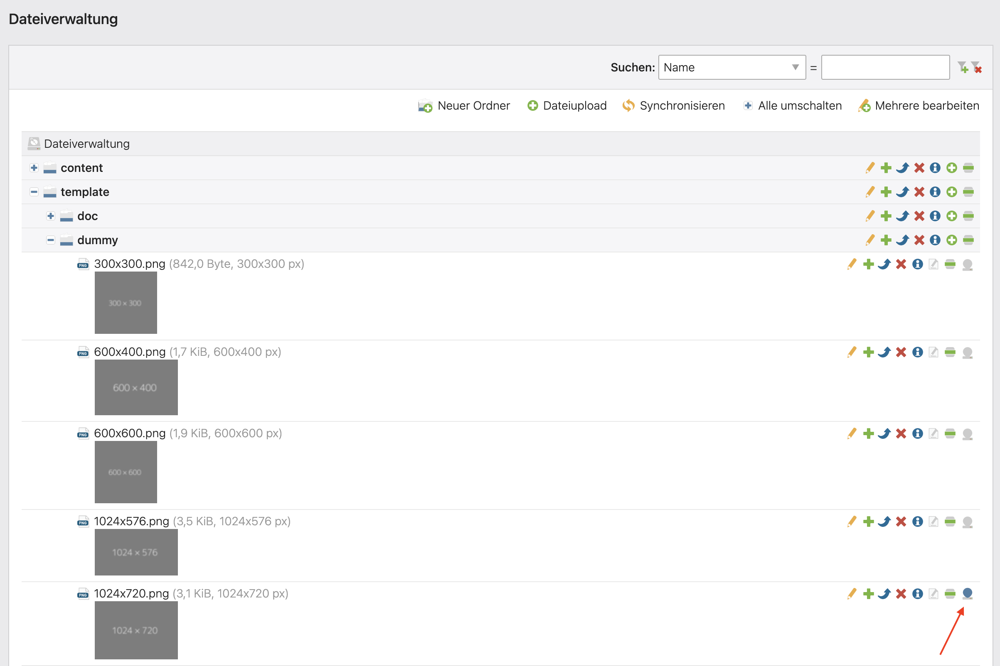
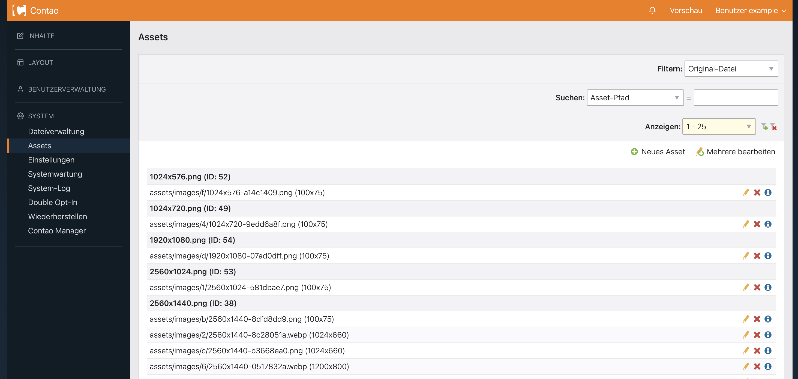

# Contao Image Usage Bundle

## About
This bundle has the goal to find all used files in the frontend.
That is for images (also assets) and downloads (pdfs, etc.)

## Installation
Install [composer](https://getcomposer.org) if you haven't already.
Afterwords, you can add the bundle like this, in your composer.json:
```json
"repositories": [
  {
    "type": "vcs",
    "url" : "https://github.com/mediamotionag/contao-image-usage-bundle.git"
  }
],
```

On the terminal you can install it then:
```sh
composer require mediamotionag/contao-image-usage-bundle
```

## Usage
1. Install Bundle (above)
2. Update Database: vendor/contao/manager-bundle/bin/contao-console contao:migrate
3. Reset Image-Cache (we need to track the asset generation to map the originals and assets)
4. Run Contao Search-Indexer: php vendor/bin/contao-console contao:crawl
5. In the file-manager, a new icon appears on the right side of the existing icons/actions, indicating if the file was found while crawling the webiste or not

## How it works
The first part of this bundle is, tracking the generation of assets (images-sizes and webp).
All generated assets (since last cache clear) are listed under "System > Assets".  

The second part of the bundle involves adding more logic to the contao search-index crawler (Contao 4.9+).
Meaning, while crawling the pages, this bundle looks for following information per page:  

### Links & Downloads
Source: href-attribute of all a tags
Data: Direct url to file or download-urls via get-parameter "file"  

### Images
Source: src-attribute of all img tags
Data: Direct url to file or url to asset associated with a file (via the tracking)  


### CSS-files
Source: href-attribute of all link tags
Data: css-files are scanned for url() statements, like for background-image: url(xyz.png) or font-face src  

## Screenshot
File-Manager (Icon):  
    

Assets Log:  
  


## Contribution
Bug reports and pull requests are welcome
